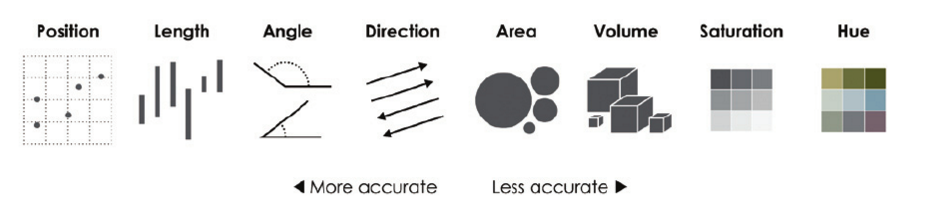

## About me

* Associate Professor of Geography at TCU (since 2012)

* Researcher: spatial demography, cities and suburbs

* Open-source developer: R packages __tigris__, __idbr__, __tidycensus__

* Twitter: @kyle_e_walker; web: http://personal.tcu.edu/kylewalker

---

## Reproduce this presentation!

* Slides and source code are available at https://github.com/walkerke/txgis2017

* Use R to re-create many of the graphics in this presentation

---
class: center, middle, inverse

# Introduction: GIS and visualization

---

## The "Datasaurus Dozen"

.footnote[Source: [Justin Matejka, Autodesk Research](https://www.autodeskresearch.com/publications/samestats)]

---

---

## GIS "visualization"

---
class: inverse, center, middle

# Should you map spatial data?  

---
class: inverse, center, middle, education
background-image: url(img/education.png)

# [Maps!](http://personal.tcu.edu/kylewalker/maps/education/)

---

## Visual variables

.footnote[Source: Yau, _Data Points_]

---

## Color

.footnote[Source: SBNation.com]

---

## Color

.footnote[Source: Mediaite/_Wall Street Journal_]
---

## Topic: educational attainment

* Research question: how has educational attainment for metropolitan area populations age 25 and up shifted since 2000?

---

## How we might map this

---

## Questions to ask when considering a map

* Is there a spatial pattern in the data? 

* Is that spatial pattern meaningful? 

* Are viewers of the map likely to understand its content without significant explanation?  

---

## Provide topical focus

---

## Show relevant data points

---

## Draw out key information

---

class: inverse, center, middle

# The benefits - and drawbacks - of interactivity

---

## Topic: international demographics

* Question: How did life expectancy shift in former Soviet republics after the fall of the USSR?  

---

## Interactivity considerations

Questions to consider: 

* How will the graphic be used?  

* Will I be presenting the graphic?  

* What expertise can I expect from my audience? 

---

## Static graphic

---

## Interactive graphic

<iframe src="ussr_py.html" height = "500" width = "800" frameborder = "0" scrolling = "no"></iframe>

---

## Animated graphic

---

## Drop-down menus

<iframe src="https://walkerke.shinyapps.io/life-expectancy-ussr/" height="500" width="800" frameborder="0" scrolling="no"></iframe>

---

## Alternative: small multiples

---
class: inverse, center, middle, education
background-image: url(img/education.png)

# [Lessons from interactive mapping](http://personal.tcu.edu/kylewalker/maps/education/)

---
class: inverse, center, middle

# How to learn more

---

## Tools of the trade

Most of the charts in this talk are reproducible - data were acquired, processed, and visualized in R

* Data acquisition: __tigris__, __tidycensus__, __idbr__

* Data wrangling: __tidyverse__

* Data visualization: __ggplot2__ (charts), __tmap__ (maps), __plotly__ (interactive plots), __shiny__ (user interfaces)

---

## Good Twitter follows for visualization principles

* Stephanie Evergreen: @evergreendata

* Andy Kirk: @visualisingdata

* Cole Knaflic: @storywithdata

* Alberto Cairo: @albertocairo

R stuff: Hadley Wickham @hadleywickham

---
class: center, middle, inverse

# Thank you!

